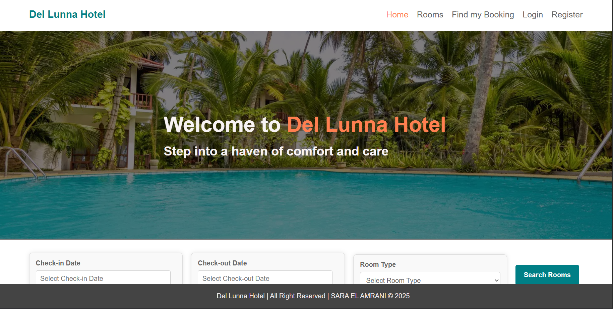
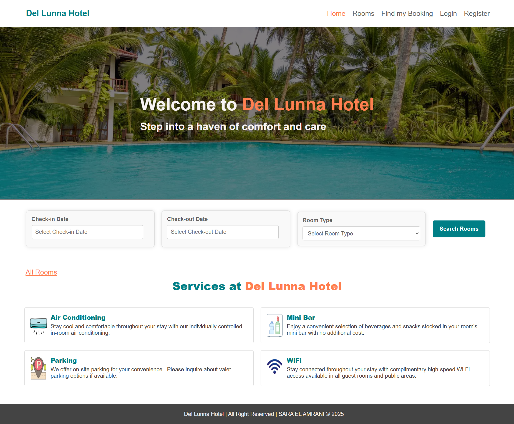
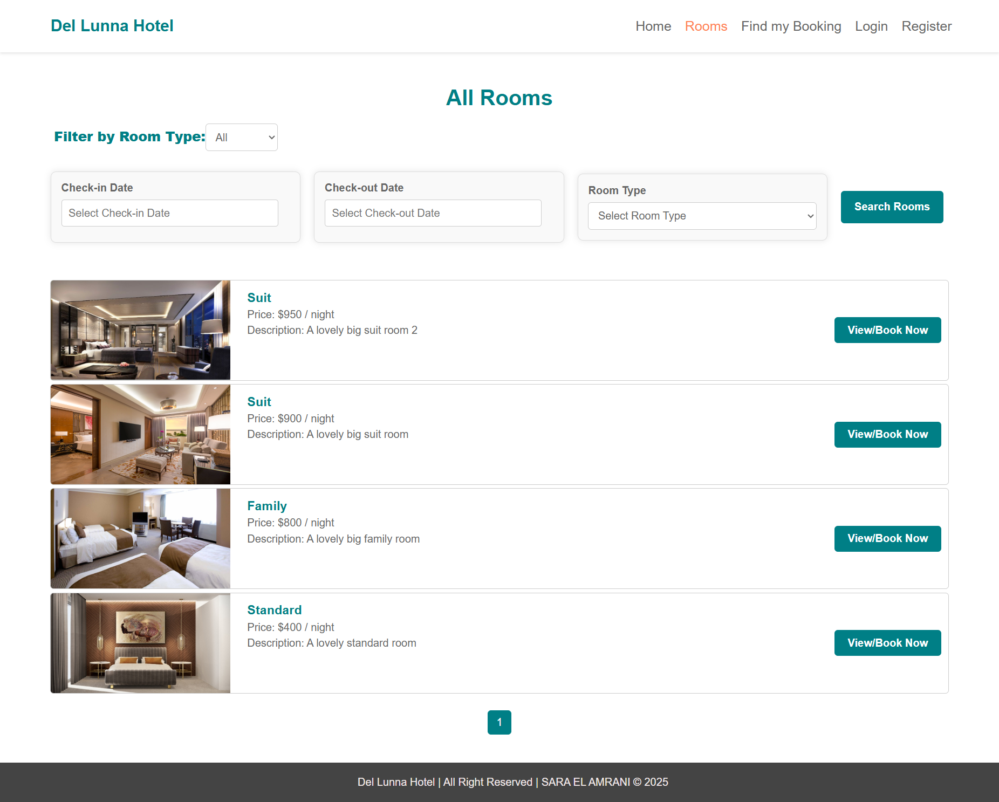
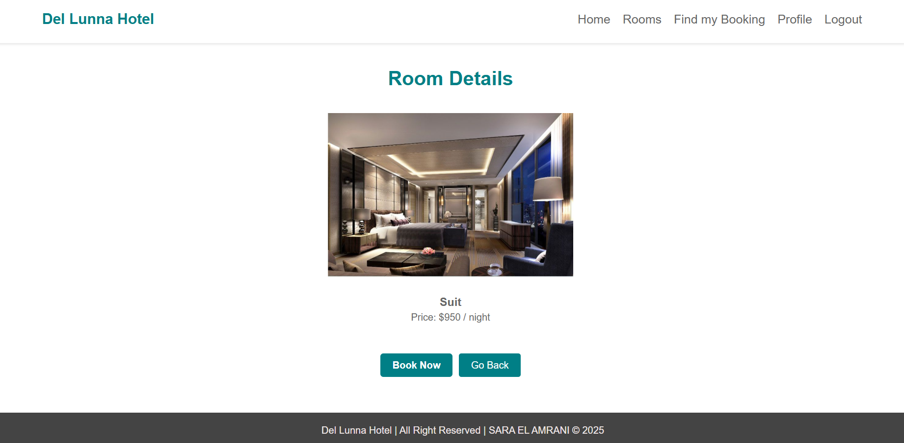
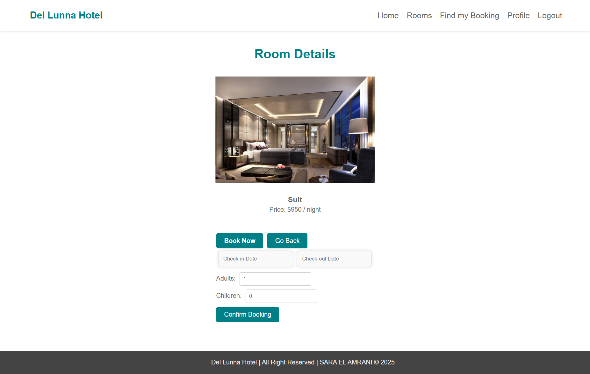
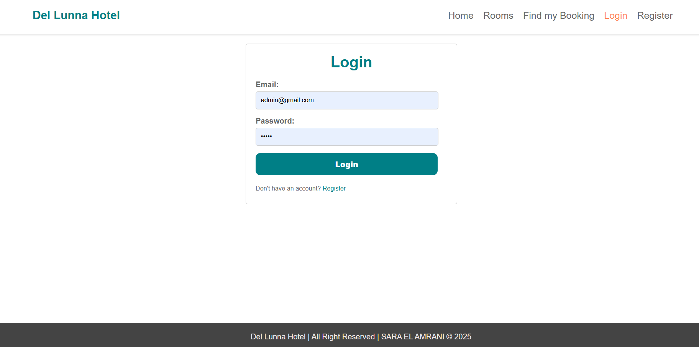
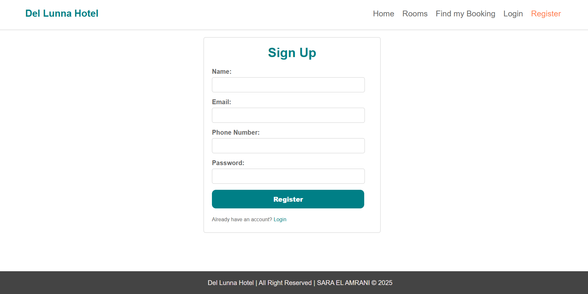
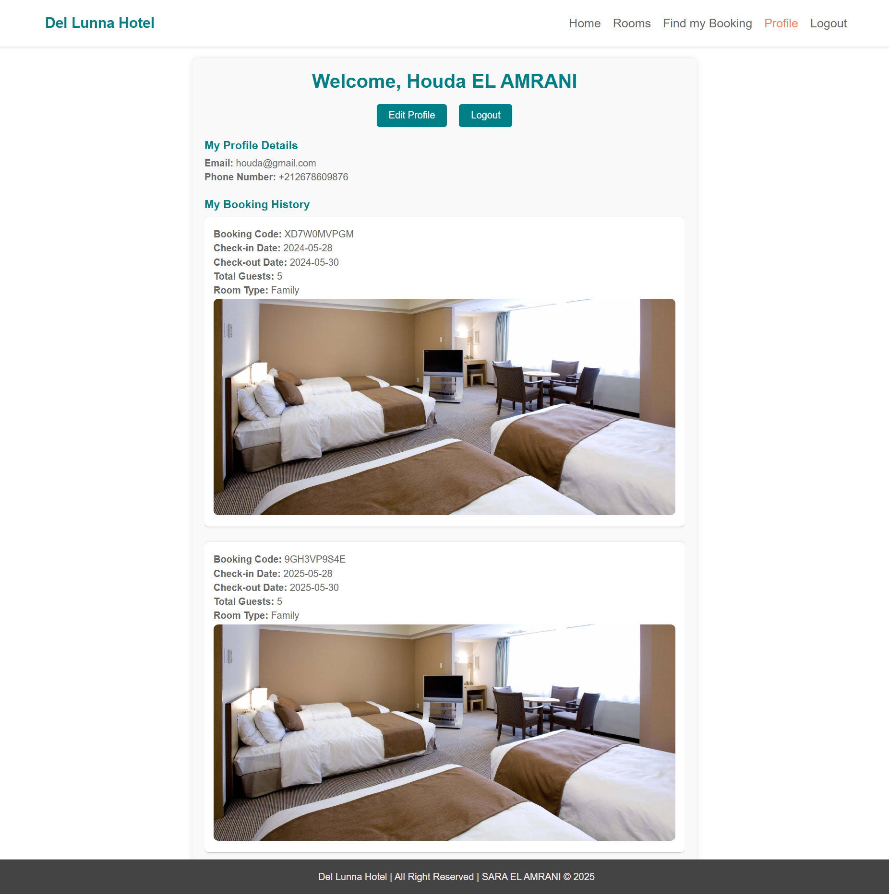
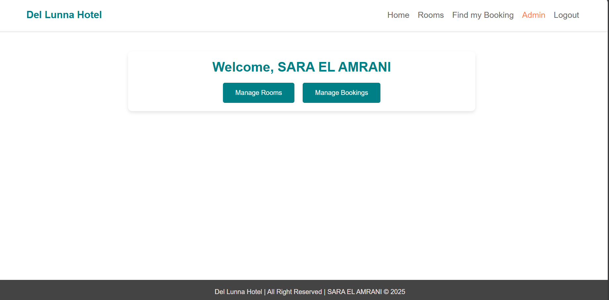

# 🏨 Del Luna Hotel - Luxury Hotel Management System

<div align="center">



**A modern, full-stack hotel management system built with Spring Boot and React**

• [Frontend Repository](https://github.com/SaraElAmrani/del-luna-hotel-react)   • [Live Demo](https://1pnxfrv9-3000.uks1.devtunnels.ms/home) 

[](https://spring.io/projects/spring-boot)
[](https://reactjs.org/)
[](https://www.oracle.com/java/)
[](https://www.mysql.com/)
[](https://aws.amazon.com/s3/)
[](LICENSE)

</div>

---

##  Table of Contents

- [Overview](#-overview)
- [Features](#-features)
- [Tech Stack](#-tech-stack)
- [Architecture](#-architecture)
- [Screenshots](#-screenshots)
- [Getting Started](#-getting-started)
- [API Documentation](#-api-documentation)

---

##  Overview

**Del Luna Hotel** is a comprehensive hotel management system designed to streamline hotel operations, from room bookings to customer management. This project demonstrates enterprise-level application development with modern technologies, featuring a RESTful API backend and an elegant, responsive frontend.

### Why Del Luna Hotel?

- 🎯 **Complete Solution**: Manage rooms, bookings, and users from a single platform
- 🔒 **Secure**: JWT-based authentication with role-based access control
- ☁️ **Cloud-Ready**: AWS S3 integration for scalable image storage
- 📱 **Responsive**: Beautiful UI that works seamlessly across all devices
- 🚀 **Production-Ready**: Built with industry best practices and clean architecture

---

##  Features

### 🔐 Authentication & Authorization
- User registration and login
- JWT token-based authentication
- Role-based access control (Admin/User)
- Secure password encryption with Spring Security

### 🏢 Room Management
- Browse available rooms with advanced filters
- View detailed room information and amenities
- Room search by type, date, and availability
- Image gallery with AWS S3 integration
- Admin panel for adding/editing/deleting rooms

### 📅 Booking System
- Real-time room availability checking
- Easy booking process with date selection
- Booking confirmation and management
- View booking history
- Cancel or modify existing bookings
- Confirmation code tracking

### 👤 User Profile
- Personal dashboard
- Edit profile information
- View booking history
- Manage account settings

### 🎛️ Admin Dashboard
- Comprehensive admin panel
- Manage all rooms and bookings
- View and edit user information
- Analytics and reporting
- Bulk operations support

### 🎨 Additional Features
- Responsive design for all devices
- Amenities showcase (WiFi, AC, Parking, Mini-bar)
- Pagination for large datasets
- Beautiful landing page with hero section
- Smooth navigation experience
- Date picker for booking dates
- Form validation

---

##  Tech Stack

### Backend Technologies

| Technology | Version | Purpose |
|------------|---------|---------|
| **Spring Boot** | 3.5.6 | Main framework for building the REST API |
| **Java** | 21 | Programming language |
| **Spring Security** | 3.5.6 | Authentication and authorization |
| **Spring Data JPA** | 3.5.6 | Database operations and ORM |
| **MySQL** | 8.0+ | Relational database |
| **JWT (jjwt)** | 0.13.0 | Token-based authentication |
| **AWS SDK S3** | 1.12.791 | Cloud storage for room images |
| **Lombok** | Latest | Reduce boilerplate code |
| **Maven** | 3.6+ | Build and dependency management |

### Frontend Technologies

| Technology | Version | Purpose |
|------------|---------|---------|
| **React** | 19.2.0 | UI library for building components |
| **React Router DOM** | 7.9.4 | Client-side routing and navigation |
| **Axios** | 1.12.2 | HTTP client for API requests |
| **React DatePicker** | 8.7.0 | Date selection for bookings |
| **React Scripts** | 5.0.1 | Build and development tools |
| **React Testing Library** | 16.3.0 | Component testing |
| **Web Vitals** | 2.1.4 | Performance monitoring |

---

##  Architecture

### Backend Architecture
```
del-luna-hotel/
├── src/main/java/ma/elamrani/dellunahotel/
│   ├── controller/              # REST API Controllers
│   │   ├── AuthController.java      → Authentication & Registration
│   │   ├── BookingController.java   → Booking CRUD operations
│   │   ├── RoomController.java      → Room management
│   │   └── UserController.java      → User management
│   │
│   ├── dto/                     # Data Transfer Objects
│   │   ├── BookingDTO.java          → Booking data transfer
│   │   ├── LoginRequest.java        → Login credentials
│   │   ├── RoomDTO.java             → Room data transfer
│   │   ├── UserDTO.java             → User data transfer
│   │   └── Response.java            → API response wrapper
│   │
│   ├── entity/                  # JPA Entities (Database Models)
│   │   ├── User.java                → User entity with roles
│   │   ├── Room.java                → Room details and pricing
│   │   └── Booking.java             → Booking information
│   │
│   ├── repository/              # Data Access Layer
│   │   ├── UserRepository.java      → User database operations
│   │   ├── RoomRepository.java      → Room database operations
│   │   └── BookingRepository.java   → Booking database operations
│   │
│   ├── service/                 # Business Logic Layer
│   │   ├── interfaces/              → Service contracts
│   │   │   ├── IUserService.java
│   │   │   ├── IRoomService.java
│   │   │   └── IBookingService.java
│   │   ├── impl/                    → Service implementations
│   │   │   ├── UserService.java
│   │   │   ├── RoomService.java
│   │   │   └── BookingService.java
│   │   ├── AwsS3Service.java        → AWS S3 file upload
│   │   └── CustomUserDetailsService.java → Spring Security user details
│   │
│   ├── security/                # Security Configuration
│   │   ├── JWTAuthFilter.java       → JWT token validation filter
│   │   ├── SecurityConfig.java      → Spring Security setup
│   │   └── CorsConfig.java          → CORS configuration
│   │
│   ├── utils/                   # Utility Classes
│   │   ├── JWTUtils.java            → JWT token generation/validation
│   │   └── Utils.java               → Helper methods
│   │
│   └── exception/               # Custom Exception Handling
│       └── OurException.java        → Custom exceptions
│
└── src/main/resources/
    └── application.properties       → Application configuration
```

### Frontend Architecture
```
del-luna-hotel-react/
├── public/
│   └── assets/images/           # Static images
│       ├── hotel.webp           → Hotel banner
│       ├── ac.png               → AC amenity icon
│       ├── wifi.png             → WiFi amenity icon
│       ├── parking.png          → Parking amenity icon
│       └── mini-bar.png         → Mini-bar amenity icon
│
└── src/
    ├── component/
    │   ├── admin/               # Admin Panel Components
    │   │   ├── AddRoomPage.jsx      → Add new room
    │   │   ├── AdminPage.jsx        → Admin dashboard
    │   │   ├── EditBookingPage.jsx  → Edit booking details
    │   │   ├── EditRoomPage.jsx     → Edit room details
    │   │   ├── ManageBookingsPage.jsx → Manage all bookings
    │   │   └── ManageRoomPage.jsx   → Manage all rooms
    │   │
    │   ├── auth/                # Authentication Components
    │   │   ├── LoginPage.jsx        → User login
    │   │   └── RegisterPage.jsx     → User registration
    │   │
    │   ├── booking_rooms/       # Booking & Room Components
    │   │   ├── AllRoomsPage.jsx     → Browse all rooms
    │   │   ├── FindBookingPage.jsx  → Find booking by code
    │   │   └── RoomDetailsPage.jsx  → Single room details
    │   │
    │   ├── common/              # Reusable Components
    │   │   ├── Navbar.jsx           → Navigation bar
    │   │   ├── Footer.jsx           → Footer component
    │   │   ├── Pagination.jsx       → Pagination controls
    │   │   ├── RoomSearch.jsx       → Room search form
    │   │   ├── RoomResult.jsx       → Room card display
    │   │   └── BookingResult.jsx    → Booking details display
    │   │
    │   ├── home/                # Home Page
    │   │   └── HomePage.jsx         → Landing page
    │   │
    │   ├── profile/             # User Profile Components
    │   │   ├── ProfilePage.jsx      → User dashboard
    │   │   └── EditProfilePage.jsx  → Edit user profile
    │   │
    │   └── service/             # API & Utilities
    │       ├── ApiService.js        → Axios API calls
    │       └── guard.js             → Route protection
    │
    ├── App.js                   # Main App component
    ├── App.css                  # Global styles
    └── index.js                 # React entry point
```

---

##  Screenshots

### 🏠 Homepage

*Modern and welcoming landing page showcasing hotel features and amenities*

### 🔍 Browse Rooms

*Advanced search and filter options to find the perfect room*

### 🛏️ Room Details

*Detailed room information with image gallery and booking options*

### 📅 Booking Process

*Simple and intuitive booking flow with date picker*

### 📅 Login Page

*Simple and intuitive authentication page*

### 📅 Registration Page

*Simple and intuitive registration page*

### 👤 User Profile

*Personal dashboard with booking history and profile management*

### 🎛️ Admin Dashboard

*Comprehensive admin panel for managing all hotel operations*

---

##  Getting Started

### Prerequisites

**Backend Requirements:**
- Java 21 or higher
- Maven 3.6+
- MySQL 8.0+
- AWS Account (for S3 bucket)

**Frontend Requirements:**
- Node.js 16+
- npm or yarn

---

### Backend Setup

#### 1. Clone the Backend Repository
```bash
git clone https://github.com/yourusername/del-luna-hotel.git
cd del-luna-hotel
```

#### 2. Configure Database

Create a MySQL database:
```sql
CREATE DATABASE del_luna_hotel;
```

#### 3. Configure Application Properties

Create or update `src/main/resources/application.properties`:
```properties
# Server Configuration
server.port=8080

# Database Configuration
spring.datasource.url=jdbc:mysql://localhost:3306/del_luna_hotel
spring.datasource.username=your_mysql_username
spring.datasource.password=your_mysql_password
spring.datasource.driver-class-name=com.mysql.cj.jdbc.Driver

# JPA Configuration
spring.jpa.hibernate.ddl-auto=update
spring.jpa.show-sql=true
spring.jpa.properties.hibernate.dialect=org.hibernate.dialect.MySQLDialect

# AWS S3 Configuration
aws.s3.access.key=YOUR_AWS_ACCESS_KEY
aws.s3.secret.key=YOUR_AWS_SECRET_KEY
aws.s3.bucket.name=YOUR_BUCKET_NAME
aws.s3.region=YOUR_REGION

# JWT Configuration
jwt.secret=YOUR_SECRET_KEY_HERE_MINIMUM_256_BITS
jwt.expiration=86400000

# File Upload Configuration
spring.servlet.multipart.max-file-size=10MB
spring.servlet.multipart.max-request-size=10MB
```

#### 4. Build and Run
```bash
# Clean and build the project
mvn clean install

# Run the application
mvn spring-boot:run
```

The backend will start on `http://localhost:8080`

---

### Frontend Setup

#### 1. Clone the Frontend Repository
```bash
git clone https://github.com/SaraElAmrani/del-luna-hotel-react
cd del-luna-hotel-react
```

#### 2. Install Dependencies
```bash
npm install
```

#### 3. Configure API Endpoint

Update `src/component/service/ApiService.js`:
```javascript
const BASE_URL = "http://localhost:8080";
```

#### 4. Start Development Server
```bash
npm start
```

The frontend will start on `http://localhost:3000`

---

## 📚 API Documentation

### Understanding the API Endpoints

The API uses RESTful conventions with the following HTTP methods:

- **GET**: Retrieve data (Read)
- **POST**: Create new data (Create)
- **PUT**: Update existing data (Update)
- **DELETE**: Remove data (Delete)

**Authentication Symbols:**
- ❌ = **Public** - No authentication required
- ✅ **User** = Requires JWT token (logged-in user)
- ✅ **Admin** = Requires JWT token with Admin role

---

### 🔐 Authentication Endpoints

| Method | Endpoint | Description | Auth Required |
|--------|----------|-------------|---------------|
| POST | `/auth/register` | Register a new user account | ❌ |
| POST | `/auth/login` | Login and receive JWT token | ❌ |

**Example:**
```bash
# Register
POST http://localhost:8080/auth/register
Body: { "name": "John Doe", "email": "john@example.com", "password": "password123" }

# Login
POST http://localhost:8080/auth/login
Body: { "email": "john@example.com", "password": "password123" }
Response: { "token": "eyJhbGciOiJIUzI1NiIs...", "role": "USER" }
```

---

### 🏨 Room Endpoints

| Method | Endpoint | Description | Auth Required |
|--------|----------|-------------|---------------|
| GET | `/rooms/all` | Get all rooms with details | ❌ |
| GET | `/rooms/{id}` | Get specific room by ID | ❌ |
| GET | `/rooms/available` | Search available rooms by dates and type | ❌ |
| POST | `/rooms/add` | Add a new room (with image upload) | ✅ Admin |
| PUT | `/rooms/update/{id}` | Update room details | ✅ Admin |
| DELETE | `/rooms/delete/{id}` | Delete a room | ✅ Admin |


---

### 📅 Booking Endpoints

| Method | Endpoint | Description | Auth Required |
|--------|----------|-------------|---------------|
| POST | `/bookings/book` | Create a new booking | ✅ User |
| GET | `/bookings/all` | Get all bookings (admin view) | ✅ Admin |
| GET | `/bookings/user/{userId}` | Get all bookings for a specific user | ✅ User |
| GET | `/bookings/{bookingCode}` | Find booking by confirmation code | ✅ User |
| DELETE | `/bookings/cancel/{id}` | Cancel a booking | ✅ User |
| PUT | `/bookings/update/{id}` | Update booking details | ✅ Admin |

---

### 👤 User Endpoints

| Method | Endpoint | Description | Auth Required |
|--------|----------|-------------|---------------|
| GET | `/users/all` | Get all users | ✅ Admin |
| GET | `/users/{userId}` | Get user profile by ID | ✅ User |
| PUT | `/users/update/{userId}` | Update user profile | ✅ User |
| DELETE | `/users/delete/{userId}` | Delete user account | ✅ Admin |


---

## 📁 Key Components Explained

### Backend Components

| Component | Purpose |
|-----------|---------|
| **Controllers** | Handle HTTP requests and return responses |
| **DTOs** | Transfer data between layers without exposing entities |
| **Entities** | Represent database tables with JPA annotations |
| **Repositories** | Interface with the database using Spring Data JPA |
| **Services** | Contain business logic and coordinate between layers |
| **Security** | JWT authentication, authorization, and CORS configuration |
| **Utils** | Helper classes for JWT token management and utilities |
| **Exceptions** | Custom exception handling for better error messages |

### Frontend Components

| Component | Purpose |
|-----------|---------|
| **Admin Components** | Admin dashboard for managing hotel operations |
| **Auth Components** | Login and registration forms |
| **Booking Components** | Browse, search, and book rooms |
| **Common Components** | Reusable UI elements (Navbar, Footer, Pagination) |
| **Profile Components** | User account management and booking history |
| **Services** | API integration using Axios and route protection |

---

## 👨‍💻 Author

**SARA EL AMRANI**

- GitHub: [@SaraElAmrani](https://github.com/SaraElAmrani)
- LinkedIn: [Sara El Amrani](https://www.linkedin.com/in/sara-el-amrani-4619041a6/)
- Portfolio: [elamranisara.com](https://elamranisara.com/)

---

##  Acknowledgments

- [Spring Boot Documentation](https://spring.io/projects/spring-boot)
- [React Documentation](https://react.dev/)
- [AWS S3 Documentation](https://aws.amazon.com/s3/)
- [JWT.io](https://jwt.io/)

---

<div align="center">

**⭐ If you find this project helpful, please give it a star!**

Made with ❤️ by me Sara El Amrani

</div>
